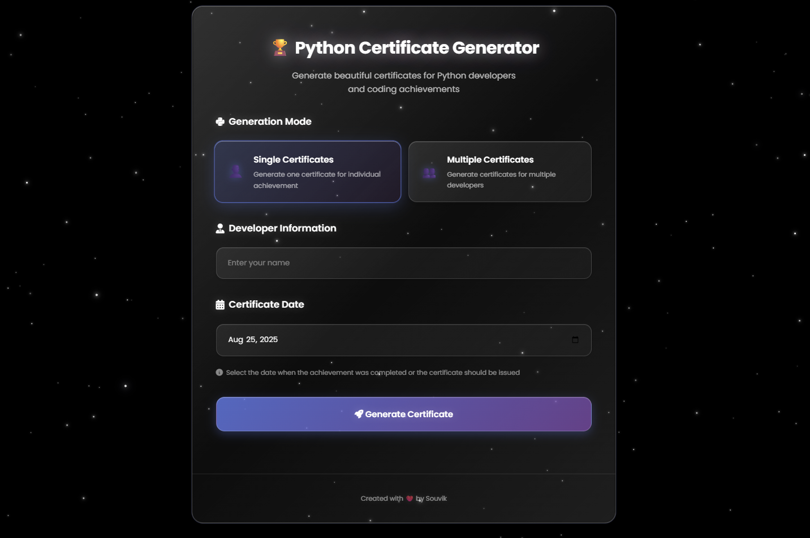

# 🏆 Python Certificate Generator

A modern web application for generating beautiful Python-themed certificates with a futuristic crystal glass UI and animated cosmic background.

## 🚀 Live Demo


**[Live Application](https://your-deployment-link.com)** - *Deployment link will be added here*

## � What It Does

- Generate individual or bulk Python certificates
- User can put custom date


## 🛠 Tech Stack

- **Backend**: Python, Flask
- **Image Processing**: Pillow (PIL)
- **Frontend**: HTML5, CSS3, JavaScript
- **UI Design**: Crystal Liquid Glass, Responsive Design
- **Fonts**: Dancing Script, Mr. De Haviland

## � Installation

1. **Clone and setup**
   ```bash
   git clone <repository-url>
   cd certificate_generator_web
   python -m venv .venv
   ```

2. **Activate environment**
   ```bash
   # Windows
   .venv\Scripts\activate
   
   # macOS/Linux
   source .venv/bin/activate
   ```

3. **Install dependencies**
   ```bash
   pip install flask pillow
   ```

4. **Run application**
   ```bash
   python app.py
   ```

5. **Open browser**: `http://127.0.0.1:5000`

## 📁 Project Structure

```
├── app.py                    # Flask application
├── certificate.png          # Certificate template
├── DancingScript-Regular.ttf # Font files
├── MrDeHaviland-Regular.ttf
├── templates/
│   └── index.html           # Main UI
└── Certificates/            # Output folder
```

## 🎯 Usage

1. **Single Certificate**: Enter one name, download PNG
2. **Bulk Certificates**: Enter names separated by commas, download ZIP

Example: `Alice Python, Bob Django, Carol Flask`

---
<div align="center">

### Created with ❤️ by **Souvik Bag**

---

⭐ Star this repo if you found it helpful!
</div>